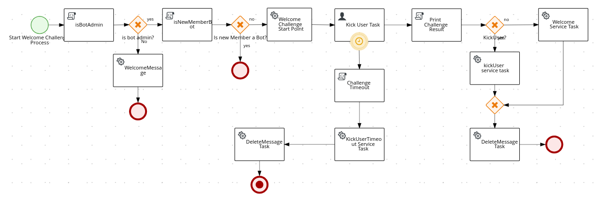

# ReBot Welcome Message Plugin

This plugin isn't useful for who is already in a Telegram group chat.
Its purpose is enable a more interactive way to new members to join the chat.

When a new member joins the group chat the new member will be asked to answer a challenge.
This challenge is a new question, a math question, and if:

 - if the bot does not have admin rights on the given group, only a welcome message will be displayed to the new user.
 - if the new member is bot, ignore it.
 - if the bot is admin, the process will start and a challenge will be sent to the new member.
 - if the answer is incorrect: new member will be kicked and banned for 30 minutes.
 - if the new member didn't answer within 240s: will be kicked and banned for 30 minutes.
 - correct answer, then the bot will welcome the new member :)
 - after the challenge is ended, all messages sent by this plugin will be deleted.

The main purpose of this is to avoid people join the chats to spread spam messages or bots not related with the purpose
of the chat group.

It consists in a [Kogito](https://kogito.kie.org/) process that will take care of the new member flow, the process flow looks like:

### Did you find a bug or do you have a suggestion?
Feel free to raise a [issue](https://github.com/rebase-it/rebot/issues/new) or send a email: just@rebase.it